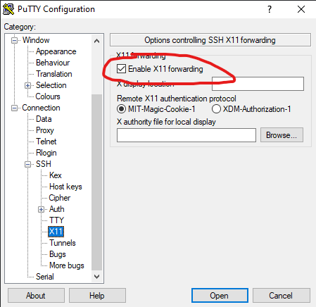

# SSH GUI Forwarding 
For this tutorial I'm using [PuTTY](https://putty.en.softonic.com/) since it is a lot easier to configure gui forwarding.

First, install [VcXsrv](https://sourceforge.net/projects/vcxsrv/), which is the X11 forwarding server. Follow the instructions and launch it. The `X` icon should appear in the tray to show that it is running.

Open Putty, go to `Connection > SSH > X11` and enable X11 forwarding. 



That's it, as long as you haven't edited the `.bashrc` on the server (in my case, the pi). To test, install some gui apps:
```bash
sudo apt install x11-apps
```
And then run one of the apps:
```bash
xcalc 
```
A nice little window with a calculator should appear


**Helpful Links:**
* [This stack question](https://unix.stackexchange.com/questions/207365/x-flag-x11-forwarding-does-not-appear-to-work-in-windows)
Doesn't even help, here is another sorta good link: https://jack-kawell.com/2020/06/12/ros-wsl2/
and this if you have to use p has some good things although I never got found any pivotal data.  
* [Tutorial to install WSL2](https://jack-kawell.com/2020/06/12/ros-wsl2/), although not exactly directly addressing the problem, has a good gui forwarding section. I used one of the commands, `echo 'export DISPLAY=<your_ip_address>:0.0' >> ~/.bashrc` . Don't know what else I used to get it to work.
* [How to fix F keys in Putty ](https://codeyarns.com/tech/2013-01-21-byobu-function-keys-do-not-work-in-putty.html
)  in case you have to use PuTTY instead of OpenSSH.
* [Ancient Forum Post](https://fabianlee.org/2018/10/14/ubuntu-x11-forwarding-to-view-gui-applications-running-on-server-hosts/
%20https://bbs.archlinux.org/viewtopic.php?id=88883) that might help.

