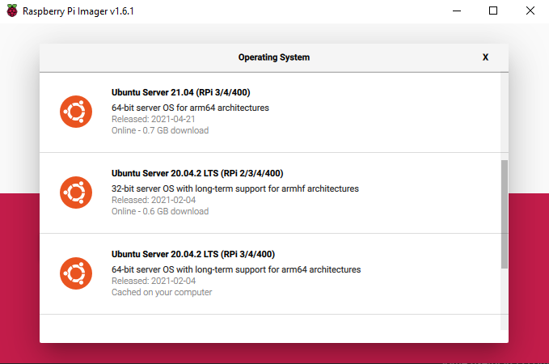

# ROS Installation and Setup

## Materials
- Raspberry Pi 4
- Sandisk microSD card (32 GB)
- microHDMI (A-M)
- Keyboard (and mouse, maybe)
- Ethernet for the Pi to facilitate the installation

## Installing the OS
First, install the [Raspberry Pi Imager](https://www.raspberrypi.org/software/). Open it and choose an OS, in my case Ubuntu Server 20.04. I'm using the server distro since in the final product we won't need a desktop or an guis for that matter. Make sure to choose the 64-bit distro. Before imaging, make sure your microSD is connected to your computer.



Once ubuntu is installed, put the microSD into the Pi, plug in the ethernet (or [use normal WiFi](https://ubuntu.com/tutorials/how-to-install-ubuntu-on-your-raspberry-pi#3-wifi-or-ethernet)). On your first boot, connect an HDMI and keyboard (no mouse needed) to access the command line. Once you are in, run `sudo apt update` and `sudo apt upgrade` to make sure everything is up to date and test your network connection. Once you see everything works, you need to set your static hostname so you don't have to connect with IP using ssh. 
```bash
hostnamectl set-hostname <your_hostname>
# ex
hostnamectl set-hostname hello_world
```
To verify everything works, run `hostname` and see if the result matches your input. To connect with SSH, I configured the pi with a hostname of `hyperion4516` and a default username of `ubuntu`. 
!!! note 
    For debugging the IP of your pi, I recommend using [Advanced IP Scanner](https://www.advanced-ip-scanner.com/). Look for an ubuntu username and copy the IP. You can use `ssh ip_address` to connect as as well.

## Connecting with SSH

Using OpenSSH (on any OS, really) you can connect to the Pi with:
```bash
ssh ubuntu@hyperion4516 # username@hostname
```
It will prompt you for the password, which is `hyperion4516`.

!!! note
    You can also use [PuTTY](https://putty.en.softonic.com/), which might actually be a better solution. It has easy configs but an ugly command line (But you can fix that). It makes gui forwarding very easy.

## Installing ROS

From the SSH client connected to the server, you can then follow the installation guide for [ROS Noetic](http://wiki.ros.org/noetic/Installation/Ubuntu). Install `ros-noetic-desktop-full` for all the packages you need. Make sure to properly configure and source your `.bashrc`	 file for use in ROS with these commands:
```bash
echo "source /opt/ros/noetic/setup.bash" >> ~/.bashrc
source ~/.bashrc # It will automatically source now
```
Also, actually follow [this guide](https://wiki.ros.org/ROS/Tutorials/InstallingandConfiguringROSEnvironment) on confirming setup and making a sample workspace (that I didn't follow the first time). Each time you need to access packages in your workspace, run these commands:
```bash
    cd ~/catkin_ws # go to the workspace
    catkin_make # build the packages
    source devel/setup.bash # make sure the CLI knows about them
```
I believe doing `. ~/catkin_ws/devel/setup.bash` does the exact same thing as the last line in the snippet above. Both add the workspace to the ROS Environment. To confirm, run
```bash
echo $ROS_PACKAGE_PATH # the ws directory should be included
```
Some useful ROS commands are:
```bash
roscd <package> # go to package directory
rosls <package> # list the subdirectories and files in package
rosed <package> <file> # edit package file with Vim
```

## Using Byobu

Once you are done with the basic setup, I would recommend running `byobu` to activate a window switching command line thing. It helps with ROS stuff. Some simple hotkeys are:

-  `F2`: to create a new window
- `F3, F4`: To switch between active windows
- `Shift + F6`: To close active window

Here is a  [cheatsheet](https://www.linuxsecrets.com/3326-byobu-commands) with most of the comands.

**The setup should be all done!**